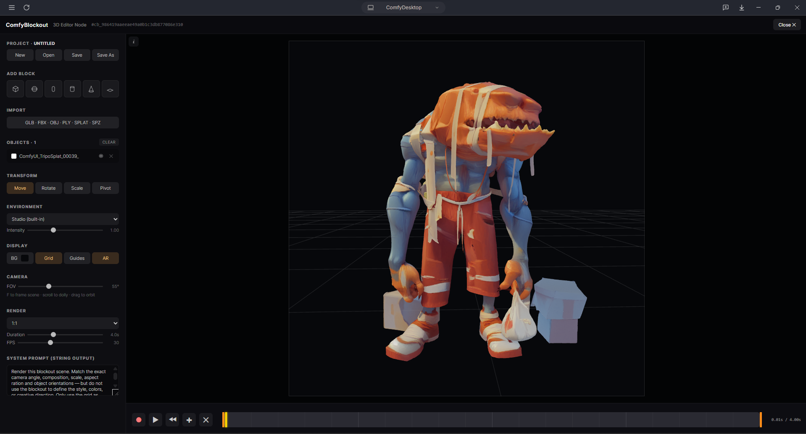
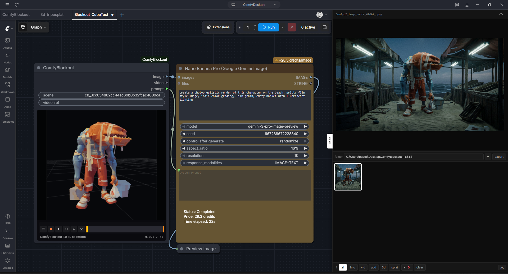
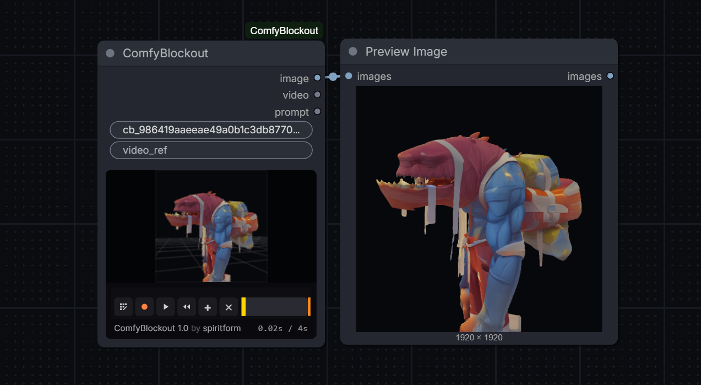

# ComfyBlockout

3D editor node for ComfyUI — build a blockout scene (primitives, GLB, FBX with animation, gaussian splats, particle emitters), key-frame both the camera path *and* per-object motion, and feed the rendered mp4 + start image + scene prompt straight into Seedance / Nano Banana / Flux / any downstream model.



## What it does

- Drop the **ComfyBlockout** node onto your canvas — it ships with a live in-node 3D viewport.
- The node body shows a real-time three.js preview with a mini transport (record / play / rewind / add-key / clear) and a scrub timeline. Edit the scene without ever leaving the canvas.
- Click **Edit** in the in-node bar → fullscreen 3D editor opens with the full toolset: add primitives, import meshes, spawn particle emitters, animate individual objects, sculpt a camera path, save as a named project.



- Three outputs ready to wire downstream:
  - `image` (IMAGE) — first frame / snapshot, wires into Seedance `image_N` slots, Nano Banana `images`, Flux text-to-image start image
  - `video` (VIDEO) — recorded mp4, wires into Seedance `video_1`, Wan motion ref, LTX
  - `prompt` (STRING) — editable system prompt, wires into Nano Banana / Flux / any text-to-image prompt input



## Features

**Scene building**
- 7 primitive kinds (cube, sphere, capsule, cylinder, cone, plane, custom-import) auto-colored from a curated 12-color named palette so each block reads as "the **red** cube is the car driving down the street" when prompting
- Drag-and-drop or Import button: GLB / GLTF / FBX (with AnimationMixer) / OBJ / PLY mesh / PLY+SPLAT+KSPLAT+SPZ gaussian splats
- **Particle emitters** — GPU shader-driven Points cloud, one-click add. Configurable style (soft dot / solid dot / square), emitter shape (point / box / sphere — use object Scale to resize), size + random variance, count, lifetime, initial speed, spread cone, gravity, wind, turbulence, additive/normal blending, and an optional sprite texture upload.
- Outliner with per-row color swatch, visibility toggle, delete, and **double-click to rename**
- Studio HDRI environments (built-in + Polyhaven presets)

**Animation**
- **Camera keyframes** — pos + target + up (roll preserved) + fov, per-key easing (linear / ease-in / ease-out / ease-in/out / through)
- **Per-object keyframes** — position + rotation + scale animated on any primitive, import, or particle emitter. Cyan diamond track sits above the green camera track on the timeline.
- **"Through" waypoints** — hollow diamonds. Positional-only Catmull-Rom controls that bend a smooth curve through them without adding a time anchor. Auto-defaulted when you insert a key between existing keys.
- **In-scene motion path** — subtle helper geometry shows every animated object's path with clickable dots at each keyframe. Click a dot → playhead jumps to that key and the object snaps to it (works for through keys too).
- Delete a boundary keyframe → the next through key promotes to `easeInOut` so the object always has a defined start/end pose.

**Timeline & transport**
- Diamond keyframe handles above the timeline + grey position lines inside it (so the playhead never collides)
- Click to select + snap object to the key, drag to retime, right-click for the ease menu (bulk-applies to every selected key)
- **Shift+click** to multi-select keys; the ease menu batch-applies
- **Shift + ←/→** jumps to the previous/next keyframe on any track
- Plain ←/→ still frame-steps
- Playhead snaps to camera *and* object keys within 6px while scrubbing (Shift bypasses)

**Right-side properties panel**
- Auto-switches context: `PROPERTIES : Scene` (nothing selected), `PROPERTIES : Camera` (camera icon), or `PROPERTIES : <Object Name>` (double-click to rename)
- **Object** — Appearance (color + a texture eye-toggle that hides/restores diffuse maps), Transform drag-fields, and full Particle inspector when a particle emitter is selected
- **Camera** — FOV slider, pos + yaw/pitch/roll drag-fields, Reset, Render section (aspect / duration / fps)
- **Scene** — Background (Color OR Image — pick either), Environment (preset + intensity), Display (Guides / AR)

**Recording**
- `canvas.captureStream()` → MediaRecorder → ffmpeg → h264 mp4 with `+faststart` and yuv420p (so it actually plays everywhere)
- Aspect-ratio framing overlay (16:9, 9:16, 1:1, 4:5, 4:3, 21:9, free) with letterbox/pillarbox crop applied during conversion
- Duration + FPS controls — recordings auto-tween through your keyframes if you have ≥2

**Projects + persistence**
- Named server-side projects: New / Open / Save / Save As via the top bar (Ctrl+S saves), list/delete via the Open modal
- Projects live at `<comfy_temp>/comfyblockout/projects/<name>/{scene.json, assets/}` and are shared across every ComfyBlockout node on the install
- Scene + imported asset bytes both auto-save per node, so reopening a workflow restores everything
- Particle emitter config, per-object keyframes, background image, viewport state all round-trip
- Live sync between the editor and the in-node preview — edit blending / gravity / color in the editor and the preview updates without a reload
- Stable UUID per node so freshly-dropped nodes don't collide on backend storage

## Controls

### Viewport navigation

| Action | Mouse / Key |
| --- | --- |
| Orbit around target | Left-drag |
| **Pan** (screen-space) | **Middle-drag** |
| Dolly | Scroll wheel |
| Free-look (look around in place) | `Alt` + left-drag |
| Roll / dutch angle | `Alt` + right-drag |
| Frame the selected object (or all objects) | `F` |
| Reset camera to default | `Home` (or the `Reset` button in the Camera panel) |

The Camera panel has six drag-fields — Pos X / Y / Z and Yaw / Pitch / Roll. Drag horizontally to scrub the value (small default sensitivity for micro-adjustments), hold `Shift` for ×0.1 fine mode, or click without dragging to type a value directly.

### Fly mode (Unreal-style)

Hold right-mouse-button anywhere in the viewport to enter fly mode. While RMB is held:

| Action | Key |
| --- | --- |
| Look around | Move the mouse |
| Forward / Back / Strafe Left / Right | `W` / `S` / `A` / `D` |
| Down / Up (world Y) | `Q` / `E` |
| Boost ×3 | `Shift` |
| Adjust fly speed | Scroll wheel |

Release RMB to exit. The transform-tool shortcuts (`W` / `E` / `R`) are suppressed while flying.

### Transform

Click an object in the viewport or the outliner to select. The gizmo follows the current mode:

| Action | Key / Button |
| --- | --- |
| Move (translate) | `W` / Move button |
| Rotate | `E` / Rotate button |
| Scale | `R` / Scale button |
| Pivot mode (move origin without moving geometry) | Pivot icon in the viewport toolbar |
| Snap (0.25u translate / 15° rotate / 0.25 scale) | Snap icon in the viewport toolbar |
| Frame selection | `F` |
| Delete selected | `Delete` / `Backspace` |
| Duplicate selected | `Ctrl` + `D` |
| Copy / Cut / Paste (paste is in-place) | `Ctrl` + `C` / `X` / `V` |
| Rename object | Double-click name in the outliner (or the properties title) |

### Keyframes

| Action | Key / Mouse |
| --- | --- |
| Play / pause preview | `Space` |
| **Set keyframe at playhead** (object or camera) | `S` — keys the selected object; camera if none selected |
| Step one frame | `←` / `→` |
| **Jump to previous / next keyframe** | `Shift` + `←` / `→` |
| Select keyframe + snap object to it | Click a diamond |
| Add / remove keyframe from selection | `Shift` + click a diamond |
| Retime keyframe | Drag a diamond |
| Ease menu (bulk-applies to every selected key) | Right-click a diamond |
| Delete selected keyframes | `Delete` / `Backspace` (or via the ease menu) |
| Jump to a keyframe from 3D | Click one of the small dots on the motion path |

### Edit

| Action | Key |
| --- | --- |
| Undo | `Ctrl` + `Z` |
| Redo | `Ctrl` + `Shift` + `Z` (or `Ctrl` + `Y`) |
| Save project | `Ctrl` + `S` |

## Install

Drop or symlink this folder into your ComfyUI `custom_nodes`:

```
ComfyUI/custom_nodes/ComfyBlockout/
```

Or via ComfyUI-Manager: search "ComfyBlockout" and install.

Restart ComfyUI. The node appears under the **video** category.

## Requirements

Python deps (pinned in `pyproject.toml`, installed automatically by ComfyUI-Manager):
- `imageio-ffmpeg` — bundles a static ffmpeg binary used as a fallback for mp4 conversion when one isn't on PATH
- `opencv-python` — first-frame extraction for the IMAGE output when no snapshot exists
- `Pillow`, `numpy` — image loading + tensor conversion

ComfyUI itself provides `torch`, `aiohttp`, and (on a recent frontend) `comfy_api.input.video_types.VideoFromFile`. If `VideoFromFile` isn't available the VIDEO slot falls back to a path string.

**Optional but recommended:**
- A system `ffmpeg` on PATH — faster than the imageio-ffmpeg fallback and produces marginally smaller files. ComfyBlockout uses whichever it finds first (PATH → imageio-ffmpeg → no conversion). If neither is available, the VIDEO output stays as `.webm` which Seedance won't accept.

**Browser:** any modern Chromium / Firefox with WebGL 2 + ES modules + import maps (basically anything from the last three years). The editor + node body are both iframed three.js scenes.

## Quick start

1. Drop a ComfyBlockout node onto the canvas — it spawns with a single random-colored cube on a grid.
2. Click the edit icon in the in-node bar to open the full editor.
3. Add primitives, drop a GLB/FBX, or click the particle icon to spawn an emitter.
4. Move objects with the gizmo. `S` drops a keyframe at the current time (object if one is selected, camera otherwise).
5. Scrub the playhead to a new time, move the object / camera, hit `S` again. Repeat.
6. Right-click a keyframe → set ease. Or click a dot on the in-scene motion path to jump to that key.
7. Hit **Record** (red dot) — recording length matches the Duration slider. mp4 lands on the node's `video` output and is saved as a project asset.
8. Wire the three outputs into Seedance / Nano Banana / Flux / Wan.

## Roadmap

- [x] Primitives, GLB, OBJ, FBX (+ animation)
- [x] PLY / SPLAT / KSPLAT / SPZ gaussian splat loading via sparkjs
- [x] Particle emitter (GPU-driven, per-emitter config)
- [x] Aspect-ratio framing overlay + cropped mp4 output
- [x] Scene + asset autosave / restore (full round-trip, including particle config + per-object keyframes + bg image)
- [x] Editable prompt output with a model-tuned default
- [x] Keyframed camera path with per-key easing
- [x] Per-object keyframes (pos/rot/scale) with in-scene motion-path viz
- [x] "Through" waypoints for smooth Catmull-Rom bends
- [x] Right-click ease menu (linear / in / out / in-out / through) + bulk apply
- [x] Named projects (Save / Open / Save As / Ctrl+S)
- [x] In-node mini timeline + transport (record without opening the editor)
- [x] Right-side properties inspector (Object / Camera / Scene)
- [ ] Visual-only "drop here" affordance when dragging files onto the in-node preview
- [ ] In-Worker splat parsing so the main thread doesn't pause on huge worldlabs / postshot captures

## License

See `LICENSE`.
